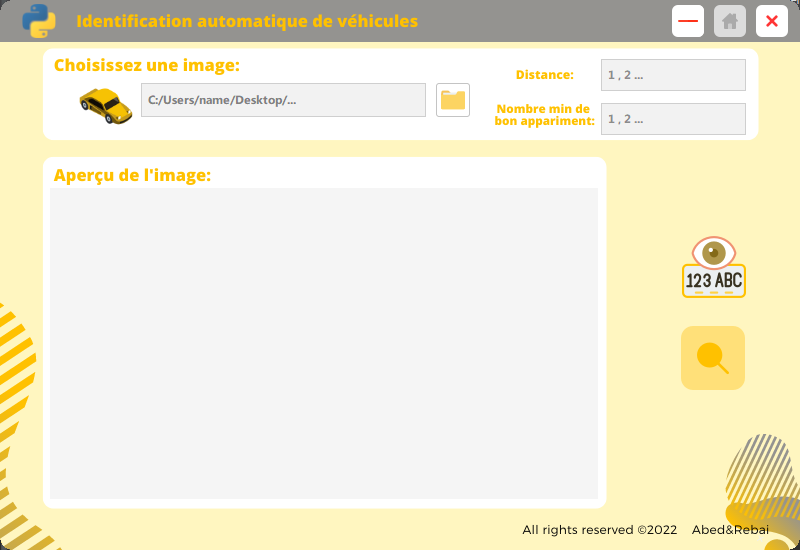
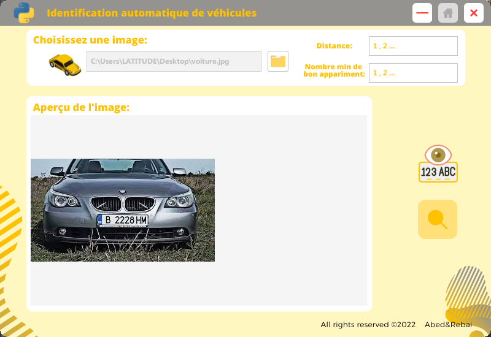
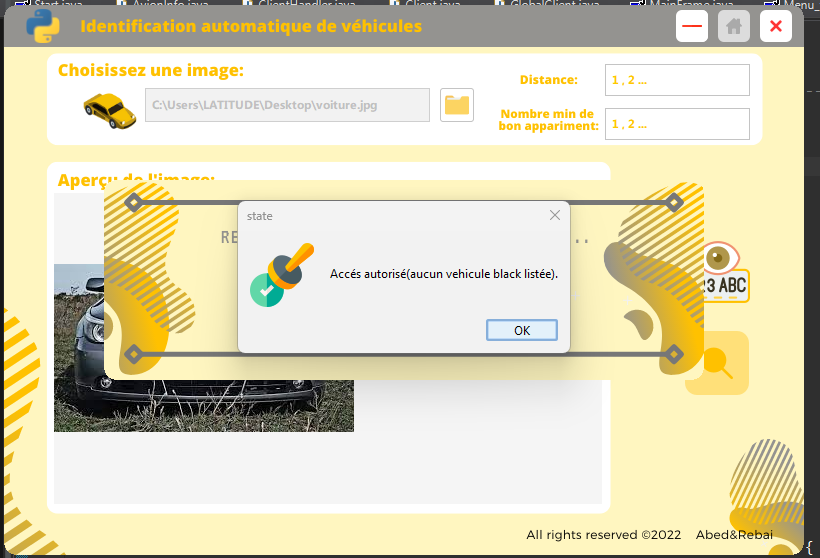
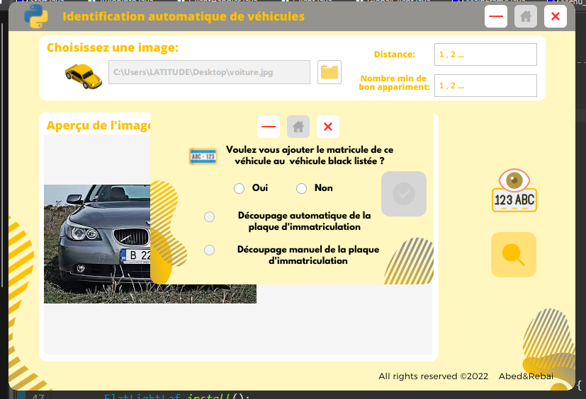
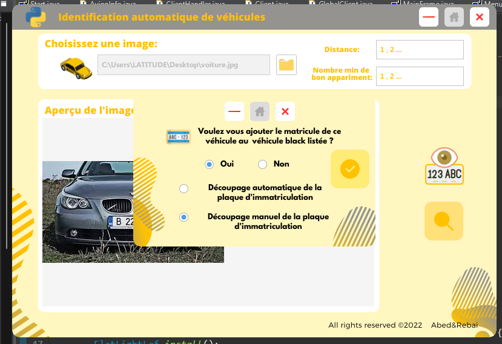
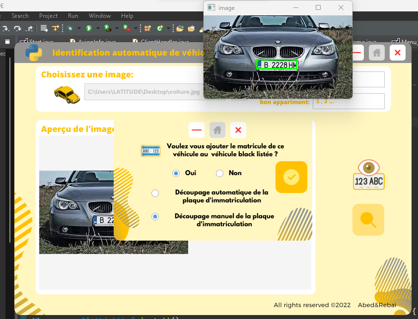
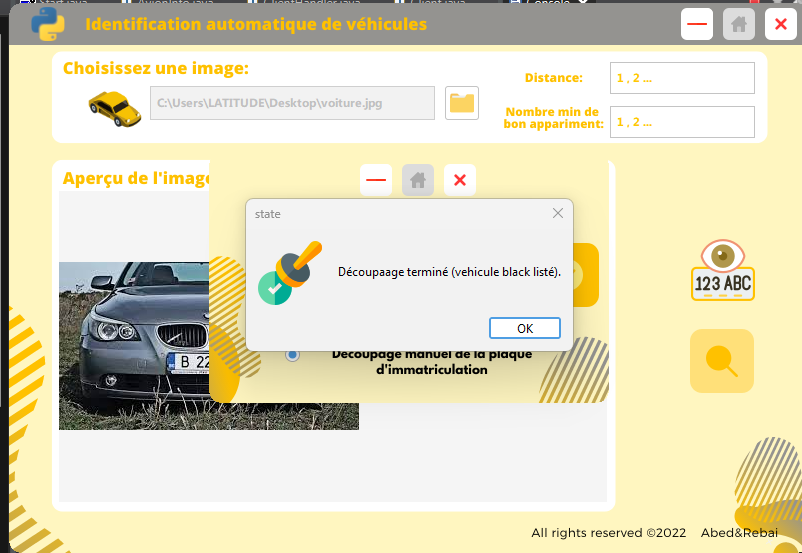
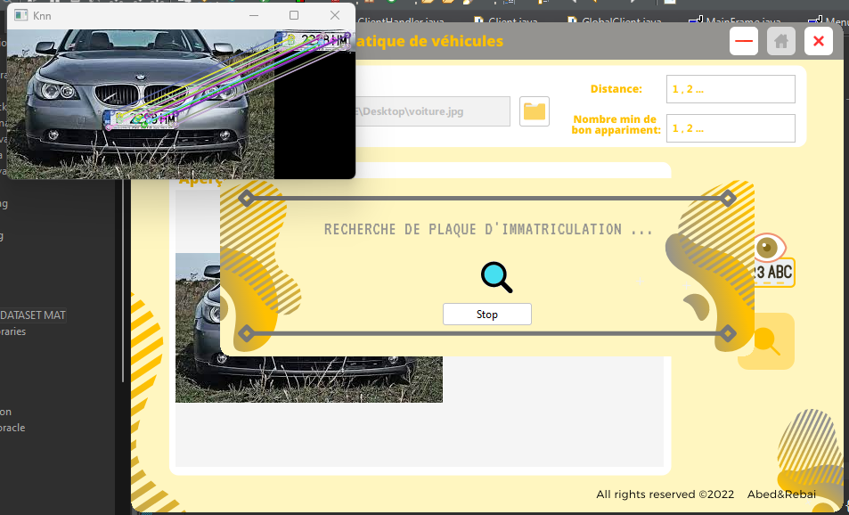

# License-plate-matcher-using-SIFT
## Description

Our system implements a License Plate Matcher using the Scale-Invariant Feature Transform (SIFT) algorithm. It extracts SIFT keypoints and descriptors from a reference image of a license plate, creating a unique fingerprint for that plate. Then, it searches for similar keypoints and descriptors in other images or frames to find potential matches.

## Features

- SIFT-based License Plate Matching

- Efficient and Accurate Matching

## Applications

This License Plate Matcher can be employed in various applications, including:

- Surveillance Systems: To identify vehicles and track their movements.

- Vehicle Tracking: To track specific vehicles for security and logistics purposes.

## GUI

  
  
  
  
  
  
  
  
  
  

## Contributors

- [@RB-Younes](https://github.com/RB-Younes)
- [@NaaaaaaaaaaDaa](https://github.com/NaaaaaaaaaaDaa)
